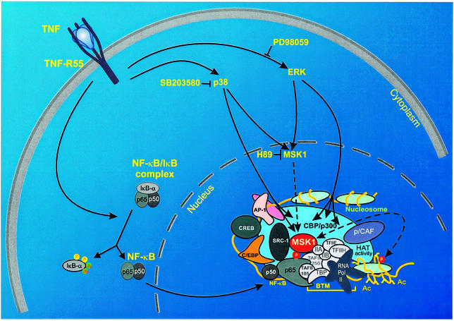
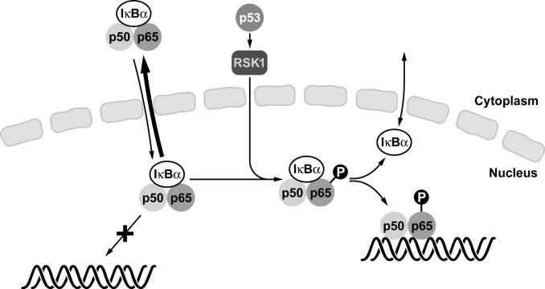
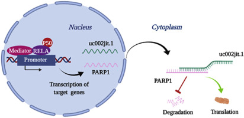

# **Rela**

RELA est un gène. Il encode la sous unité p65 de la protéine NF-κB ou nuclear factor kappa B.

Donc RELA = NF-κB-p65

* [Structure](#struct)
* [Phosphorylation](#phospho)
* [Acetylation](#acet)
* [Rôles des cibles de p65](#role)
* [Inhibiteurs de NF-κB](#inhib)
* [NF-κB et LAM](#lam)

# **Structure** {#struct}

p65 contient un domaine REL-homology domain (RHD) qui permet la liaison avec l'ADN et un domaine C-terminal transactivation domain (TAD) qui est responsable de l'interaction avec le complexe de transcription basal incluant beaucoup de coactivateurs de transcriptions comme TBP, TFIIB et CREB-CBP.

# **Phosphorylation** {#phospho}

La phosphorylation de p65 joue un rôle dans la régulation de l'activation et la fonction de NF-κB.  
p65 peut être phosphorylé soit au niveau du domaine RHD soit le domaine TAD.

## Phosphorylation sur le domaine RHD

La phosphorylation du RHD se passe au niveau de la **sérine 276** par une protéine kinase A dans le cytoplasme. Elle peut aussi l'être via la MSK1 ou mitogen and stress-activated kinase 1 sous l'induction dans le noyau de [TNFα](./TNFα) (Tumor necrosis factor alpha). [TNFα](./TNFα) va retirer la sous unité inhibatrice IκB-a, la permettant d'aller dans le noyau. NF-κB va ensuite être phosphorylée par MSK1. Cela a pour conséquence une réponse augmentée de la transcription des gènes régulés par NF-κB.

Une phosphorylation du RHD peut aussi se produire sur la **sérine 311** par la protéine kinase C.

## Phosphorylation sur le domaine TAD

La **sérine 529** peut être phosphorylé par une casein kinase II (CKII) après dissociation de la sous unité inhibitrice de NF-κB, IκBα par [TNFα](./TNFα).  

p53 est aussi un régulateur de NF-κB via l'activation de RSK1 qui va entraîner la phosphorylation sur la **sérine 536** de p65 et de la partie carboxylterminale. La phosphorylation de la **sérine 536** va diminuer son affinité avec IκBα diminuant le niveau d'export nucléaire de la protéine NF-κB.

# **Acetylation** {#acet}

Des acétylations au niveau de la lysine 221 aide à la dissociation de NF-κB et de IκBα et améliore sa fixation à l'ADN.  
L'acétylation de la **lysine 310** est essentielle pour une activité transcriptionnelle maximale de p65 sans pour autant impacter sa fixation à l'ADN.  
L'acétylation de la **lysine 122 et 123** sont, elles, négativement corrélées avec l'activité transcriptionnelle de p65.

# **Rôles des cibles de p65** {#role}

* Leukocyte activation & chemotaxis
* Régulation négative du pathway de TNFIKK
* Métabolisme cellulaire
* Processus antigénique
* Inflammation

### Système immunitaire
*Immunité adaptative et réponse à une invasion de pathogène.*
### Cancer
*Corrélation entre sa localisation nucléaire et le développement de la tumeur.*

# **Inhibiteurs de NF-κB** {#inhib}

Bortezomib --> inhibe le protéasome --> Dégradation réduite de IκBα --> inactivation de NF-κB.

# **NF-κB et LAM** {#lam}

[Bortezomib is significantly beneficial for de novo pediatric AML patients with low phosphorylation of the NF-κB subunit RelA](https://onlinelibrary.wiley.com/doi/10.1002/prca.202100072)  
Les patients avec un niveau faible de NF-κB phosphorylé répondent mieux à l'inhibiteur Bortezomib sachant que celui-ci, bloque la dégradation de l'inhibiteur de NF-B.  
*Les traitements provoquent une demande élevée en NF-κB phosphorylé ?*

[Nuclear factor-kappaB is constitutively activated in primitive human acute myelogenous leukemia cells](https://link-springer-com.proxy.insermbiblio.inist.fr/article/10.1007/s00018-013-1545-4#ref-CR84)  
*Les LSC in vitro meurent suite à des traitements inhibant NF-κB via un autre inhibiteur du protéasome : proteasome inhibitor MG-132*

[The role of the novel LincRNA uc002jit.1 in NF-kB-mediated DNA damage repair in acute myeloid leukemia cells](https://www-sciencedirect-com.proxy.insermbiblio.inist.fr/science/article/pii/S0014482720302007?via%3Dihub)  
*Un lncRNA uc002jit.1 est une des targets de RelA. Son expression déstabilise l'ARN de PARP1, diminuant les processus de réparation de l'ADN.*  

