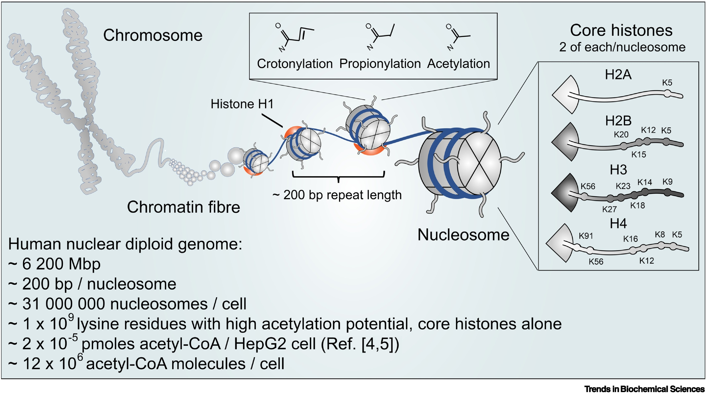

# Does chromatin function as a metabolite reservoir?

Les acétylations alternatives d'histones intègrent l'expression des gènes via les états métabolique des cellules.

Les modifications post-traductionnelles des histones (PTMs) contribuent directement à la régulation du pool de métabolites.

--> Une vue centrée sur les métabolites donne un aperçu nouveau sur les roles et l'évolution des PTMs des histones.

## Les nombreux roles des modifications post-traductionnelles PTM d'histones

Les PTM d'histones contrôlent la structure de la chromatine en changeant leurs charges impliquées dans la fixation à l'ADN et créant des sites de fixations pour les facteurs de remodellant la chromatine.
