# Focal disruption of DNA methylation dynamics at enhancers in IDH-mutant AML cells

## Astract

Dans les LAM IDH1 ou IDH2 mutant, on retrouve une hyperméthylation de l'ADN. En analysant des données de séquençage du génome entier par méthode de conversion au bisulfite, ils ont trouvé environ 4000 régions local qui était uniquement hyperméthylés dans les LAM IDHm comparé aux cellules normales CD34+. Les cellules CD34+ étant des cellules souches hématopoiétique. Ces régions semblent modestement hyperméthylées chez les TET2 mutés et leur niveau de 5-hydroxymethylation diminué dans les TET2 et IDH mutants.  
La 5-hydroxymethylation correspond à une modification épigénétique d'une base nucléique via méthylation puis hydroxylation.   
  
Comme la figure le montre, les TETs convertissent les 5-methylcytosine en ce 5-hydroxymethylcytosine qui sera ensuite oxydé en 5-formylcytosine. Un niveau de 5-hydroxymethylcytosine faible représente une absence d'activité des protéines TETs.  
Cette diminution reflète donc une inhibition des TETs par la mutation des IDHs mais aussi de celle des TETs.   
Les régions retrouvées hyperméthylés dans les IDHm sont faiblement méthylés dans les cellules CD34+. Comme l'absence de TETs engendre une méthylation et qu'avec les TETs l'ADN n'est pas méthylé, cela implique que ces régions de l'ADN sont le siège d'une méthylation/démethylation active. Lorsque le gène impliqué dans la méthylation DNMTs est muté, l'ADN est significativement moins methylé. Cela implique les DNMTs dans ce phénotype hyperméthylés des IDHm.  
Les hypermethylations retrouvés dans les LAM IDHm semblent associées à des enhancers de gènes impliqués dans l'hématopoiétiese normal et dans les LAM comme MYC et ETV6.  
Pour résumer, les mutations d'IDH dans les LAM semblent créer un déséquilibre dans la balance methylation/déméthylation qui a pour conséquences des dérégulation d'enhancer de gènes impliqués dans la pathogénèse des LAM.

## Results

### Les échantillons de LAM IDH1/2 mutés sont hyperméthylés dans des régions faiblement méthylés chez les cellules souches CD34+.

Ce résultat provient d'une analyse de 51 échantillons primaires de LAM dont 15 sont IDHm (7 IDH1 et 8 IDH2) et de 6 échantillons sains de cellules primaires CD34+.  
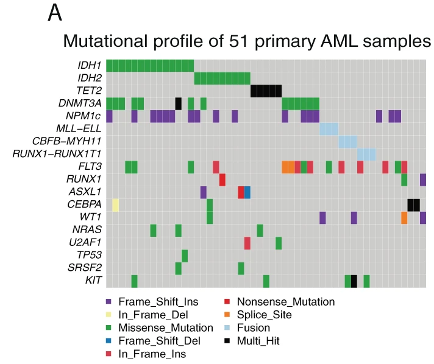  
Basés sur la méthylation de ces échantillons, ils ont retrouvé des clusters dépendants des mutations IDH/TET et DNMTs totalement écartés des échantillons sains CD34+.  
  
On remarque aussi un phénotype particulier des LAM sans mutation que ce soit IDH TET ou DNMTs mais le cluster IDH semble unique.  

Pour dire si la mutation d'IDH a un effet global sur la méthylation de l'ADN ou s'il est dépendant du contexte, ils ont analysé les niveaux de méthylation dans des régions définies par des état particuliers de la chromatines chez les progéniteurs et cellules souches hématopoiétiques.  
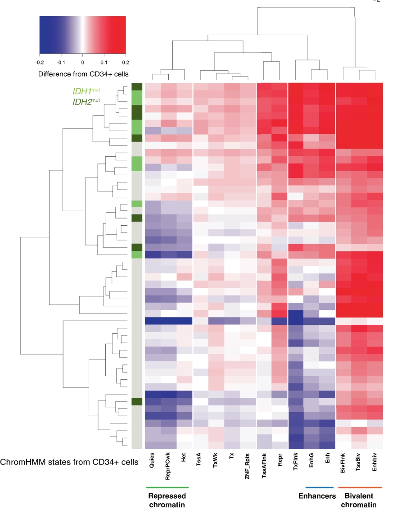  

Ils ont ensuite utilisé un logiciel appelé ChromHMM utilisant un modèle mutlivarié caché de Markov. Ce logiciel permet à partir de données liées à la chromatine comme des données de ChIP-seq de modifications d'histones de découvrir de nouveaux "schémas" combinatoires et spatiaux récurrents. Pour plus de détails, l'article sur ChromHMM : [Discovery and characterization of chromatin states for systematic annotation of the human genome](https://alexishucteau.github.io/PhD_bibliography/Discovery_and_characterization_of_chromatin_states_for_systematic_annotation_of_the_human_genome)  

Ces analyses ont pu montré que la chromatine dans un état quiescent et réprimée (donc où la transcription n'a pas lieu) ont des niveaux de méthylation plus faible dans les cellules de LAM comparées aux cellules CD34+ alors que les régions bivalentes (enrichies en CGIs (Ilots de CpGs)) semblent hyperméthylées.  

De plus, la méthylation des enhancers et des régions proches des sites de début de transcription regroupent les échantillons d'IDHm. La méthylation de ces deux sites sont significativement plus élevée dans les échantillons IDHm comparée à celle des échantillons CD34+ et LAM IDHwt.

Ce résultat se retrouve aussi de manière global mais pas significativement dans les ilots de CpGs.  

Pour aller plus loin, ils se sont intéressés aux régions différentiellement methylés.

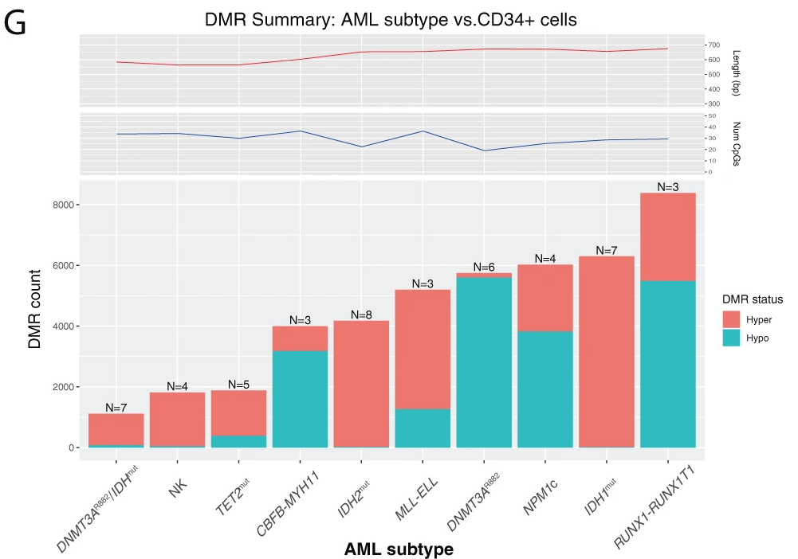

Ils ont donc comparé les différents sous types de LAM avec les cellules normales hématopoiétiques CD34+. Tous les DMRs (Régions différentiellement méthylées) dans les IDHm le sont de manières hyperméthylées comparées aux CD34+.  

De plus, ces régions semblent particulièrement déméthylées dans les cellules normales CD34+.

### Les modifications de méthylation spécifiques aux IDHm sont distincts de l'hyperméthylation des ilots de CpGs associés à la LAM et sont influencés par le type de mutation d'IDH.

Ils ont ensuite voulu définir les locis differemment methylés chez les IDHm des CD34+ qui ne le sont pas dans les autres types de LAM.

Ils ont donc défini 4388 et 2552 DMR spécifiques respectivement aux mutations IDH1 et IDH2. Une fois de plus, ces zones semblent avoir un niveau de méthylation inférieur à 0.3 chez les CD34+ ou cellules matures myeloides.  

Ils ont aussi retrouvé un recoupement important des DMR associées aux deux mutations.

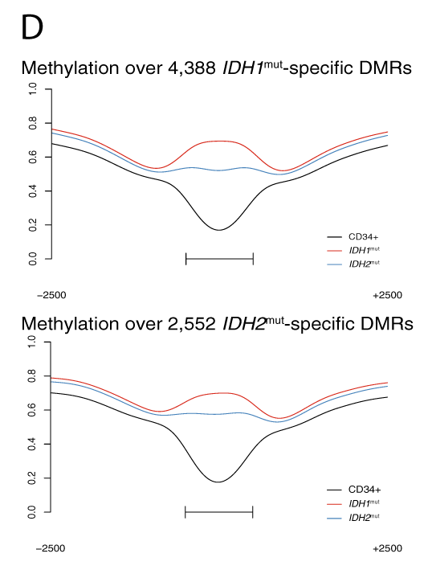

Cependant, il semble y avoir une variabilité considérable entre les différents échantillons IDH1/2. Avec notamment, une méthylation légèrement plus faible chez IDH2m que chez IDH1m.

Cette différence entre IDH1 et IDH2 dans la mutation n'est pas lié à l'abondance de l'allèle muté dans les échantillons ni dans la présence de mutation telle que NPM1c. Dans l'analyse, tous les IDH1/2m sont TETwt et DNMTwt.

A nouveau, les DMRs chez IDHm ne se retrouvent pas aussi présents dans les ilots de CpGs ni dans les promoters. La majorité des DMRs spécifiques à IDH ne se retrouvent que dans les genes bodies.

### Les hypermethylations dans les LAM TET2m chevauchent les hypermethylations spécifiques des IDHm mais n'explique pas l'étendue des changements de méthylation.

Ils ont ensuite voulu comparer les modifications de méthylation lié aux mutations de TET2. Dans les LAM, le nombre de DMR chez les TET2m comparé au CD34+ est relativement faible comparé aux IDHm.

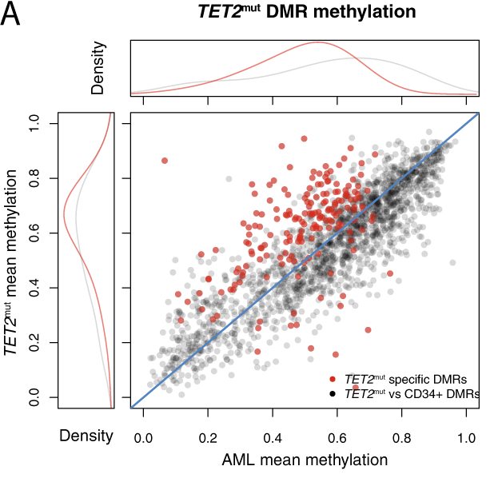

Peu de DMRs sont retrouvés chez les TET2m. Ces DMRs ne se retrouvent pas non plus dans les Ilots CpGs.

Pour mieux comprendre l'intéraction entre IDHm et TET2m, ils ont analysé les niveaux de 5-hydroxyléthylcytosine (Produit de l'activité de TET2).

Cet analyse a montré que les DMRs chez les TET2m étaient retrouvés chez les IDHm.

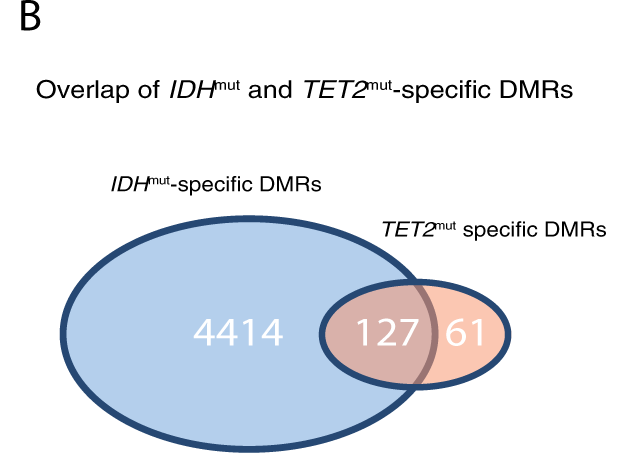

Mais aussi que le niveau moyen de méthylation dans les régions spécifiques de DMR des IDHm est significativement plus élevé chez les TET2m comparées aux CD34+.

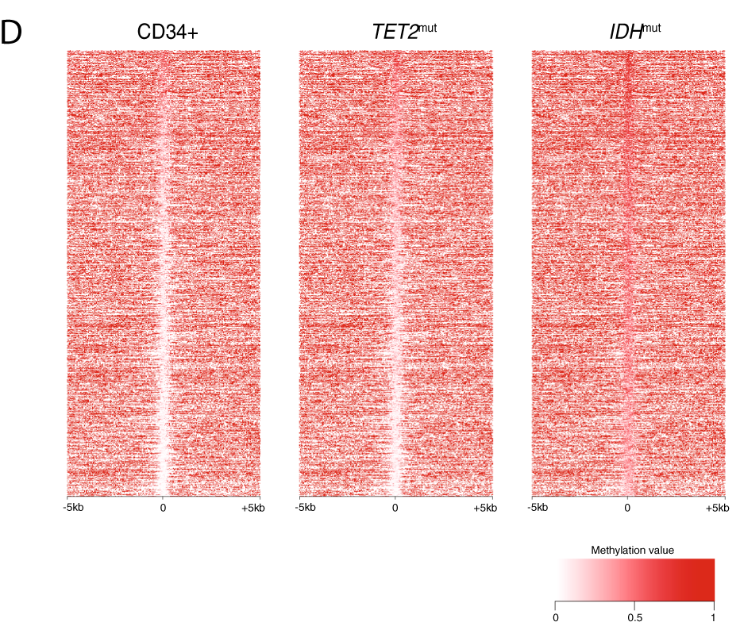

De plus, les niveaux de 5hmc semblent plus faibles chez les IDHm/TET2m dans les régions hyperméthylés communes aux LAMs mais encore plus dans les DMRs des IDHm.

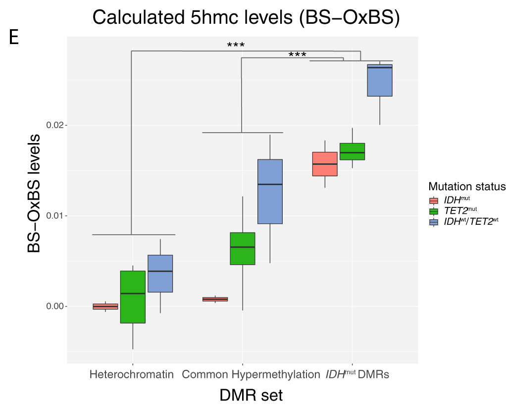

### L'hyperméthylation dans les LAM IDHm nécessitent l'activité de DNMT3A.

Wilson et al. ont voulu vérifier le lien entre DNMT3A et la mutation IDH en analysant des échantillons doubles mutants IDH1/2m et DNMT3Am.

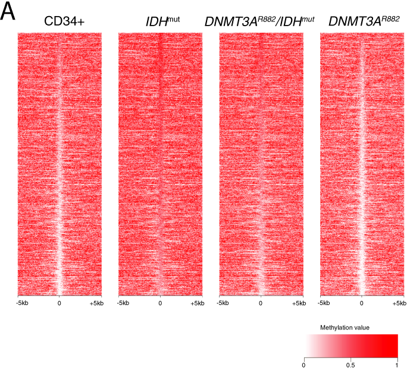

Les niveaux de méthylation des DMRs IDHm semblent toujours plus élevés chez les IDHm/DMNT3Am mais avec une amplitude moindre.

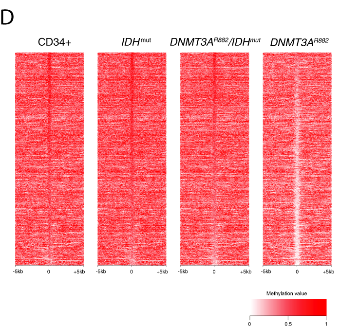
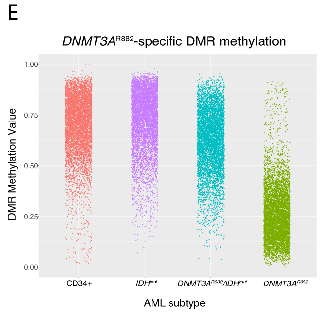
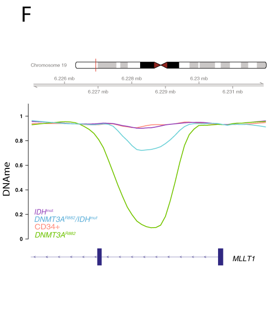

En se focalisant sur les DMRs retrouvés hypométhylés chez les DNMT3Am simple mutant, on retrouve tout de même une hyperméthylation chez les double mutants.

Ces résultats démontrent une activité de méthylation impliquant TETs et DNMT3A dans les même locus.

### Les DMRs spécifiques aux IDHm sont enrichies en enhancers.

Le groupe s'est ensuite demandé si ces régions spécifiques aux IDHm étaient localisées dans des régions particulières de la chromatine. Pour y répondre, ils ont considéré les états de la chromatines chez les CD34+ et on montré que 44% des DMRs se retrouvent dans des enhancers.

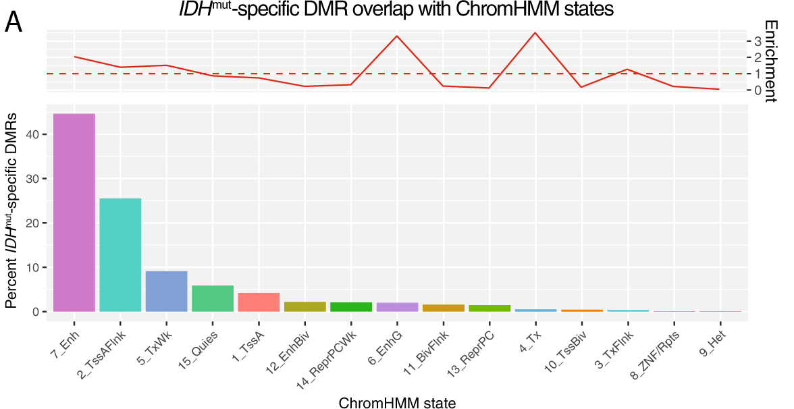

Ces résultats ne se retrouvent pas dans les méthylations dans les autres sous types de LAMs.  

Les enhancers peuvent être classés en trois types différents :

* Active
* Poised ou weak
* Repressed

Les enhancers **actifs** correspondent aux enhancers dont le gène associé est transcrit. Il est associé à une marque de modification d'histone H3K4me2 et H3K27ac.  
Les enhancers "**poised**" sont des enhancers "en attente" et sont associés aux marques H3K4me1 et H3K27me3.  
Les enhancers "**repressed**" sont des enhancers dont l'activité de régulation est bloquée par un état de la chromatine condensé. Ils sont associés aux marques H3K27me3.

Dans les LAMs IDH, la majorité des DMRs se retrouvent dans les enhancers "**actifs**".

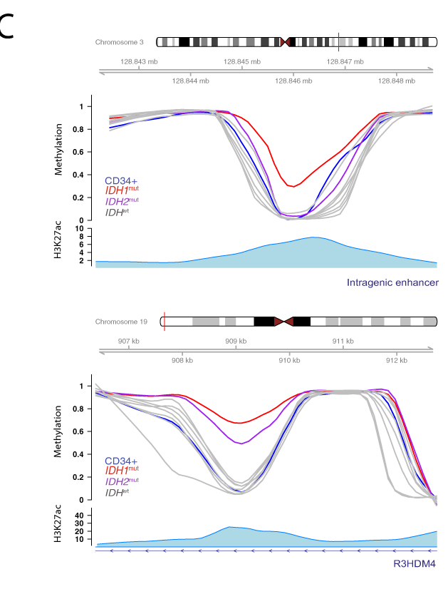

Les méthylations chez les autres sous types de LAM semblent plus présentes dans les enhancers réprimés.

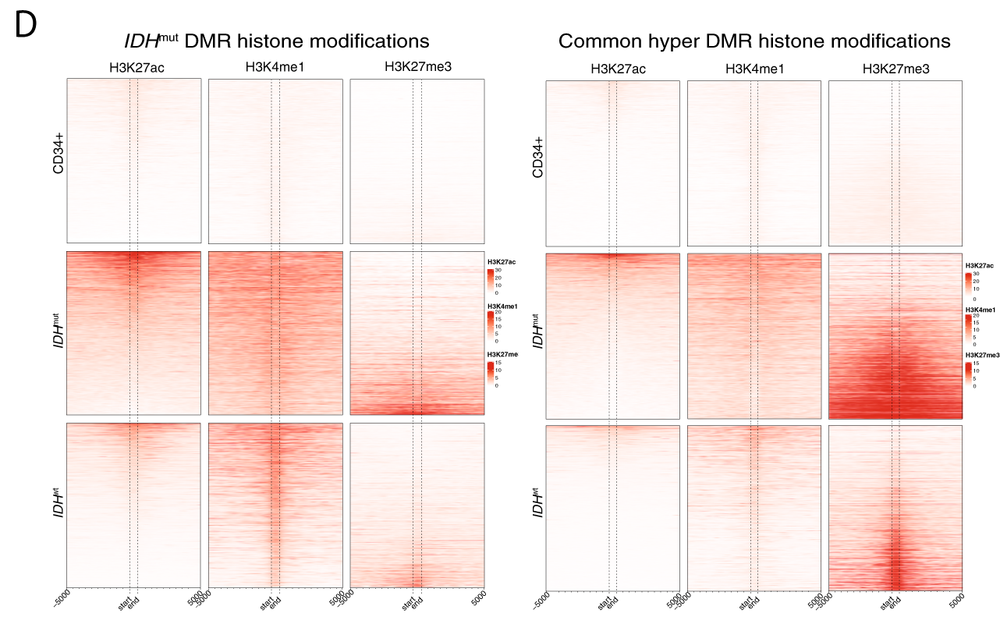

Les enhancers étant des zones de fixation des facteurs de transcription, l'analyse des séquence retrouvées dans les DMRs permet d'avoir un aperçu de ces facteurs impliqués par ces changements de méthylation.

SPI1, ETV2, GATA2, ELF4, RUNX1 et c-Myc ont été retrouvé à partir de leur motif de fixation.

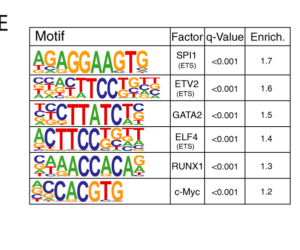

Le niveau de H3K27ac n'est cependant pas modifié par les différentes mutations IDH.

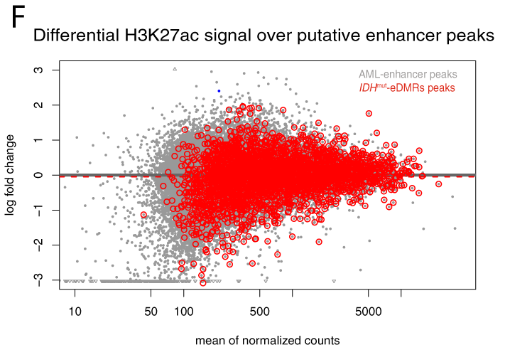

### Les DMRs spécifiques des IDH dans les enhancers forment des interactions direct avec des gènes hautement exprimés dans les LAMs.

Pour évaluer les conséquences des modifications de méthylation de ces enhancers, une analyse des expressions des gènes a été faite. Pour cela, ils ont utilisé des données d'intéraction 3D. Ces analyses ont montré que 26% des DMRs et 30% des DMR dans les enhancers se retrouvent dans des "loop anchor".

Les DMRs d'IDH dans ces loop anchors sont enrichis en super-enhancers.

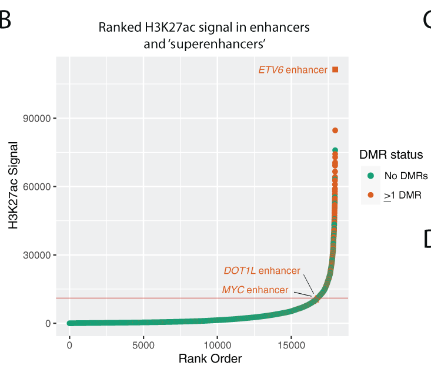

L'analyse d'expression des gènes intéragissant avec ces DMRs a montré qu'ils sont biens plus exprimés chez les IDHm.

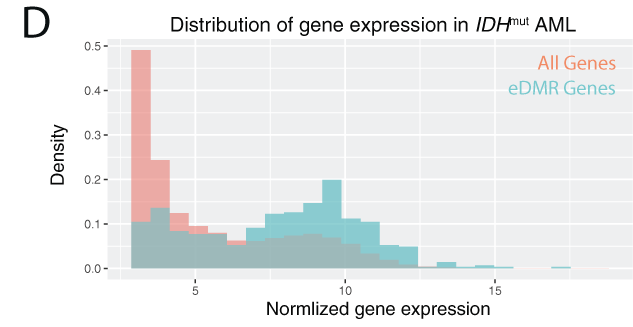

Des gènes ont ensuite été retrouvé comme MYC, ETV6, DOT1L et SRSF3 sans que leur expression ne soit fortement différentes des autres sous types de LAMs.

