# A cellular hierarchy framework for understanding heterogeneity and predicting drug response in acute myeloid leukemia

## Résumé

Le but est de comprendre comment l'hétérogénéité est liée à la réponse à la thérapie. Pour cela, ils ont déterminé la hiérarchie des cellules leucémique à partir de transcriptomes (bulk) de 1000 patients par le biais de déconvolution en utilisant des profiles références de cellules de type souches leucémiques, progénitrices et matures décrites par des analyses de single-cells. La composition hiérarchique de la leucémie est associée à des propriétés fonctionnelles, génomiques et cliniques et convergent dans 4 classes représentant Primitive, Mature, GMP [^1] et Intermédiaire. Les variations dans la composition hiérarchique entre les axes Primitives et GMP ou Primitives et Matures sont associées à la réponse à la chimiothérapie ou à la réponse au traitements ciblés respectivement. 7 gènes biomarqueurs ont été identifiés dérivant de la comparaison Primitive vs Mature et sont associés à la réponse pour 105 médicaments expérimentaux. La composition hiérarchique cellulaire se révèle être une nouvelle approche pour mieux comprendre la biologie de la maladie et faire progresser la médecine de précision dans la LAM.

[^1]: granulocyte/monocyte progenitor

## Introduction

La LAM est caractérisée par une hétérogénéité inter et intra patient. Celle-ci rend les nouvelles thérapies aussi hétérogènes et il n'existe pas de moyens fiables pour sélectionner la meilleure thérapie pour chaque patient.  
Deux approches sont actuellement utilisées pour caractériser l'hétérogénéité de la LAM. Le modèle génomique avec les modifications cytogénétiques et les mutations. Cependant, les mêmes modifications génétiques peuvent montrer des différences fonctionnelles et même en ciblant ces mutations avec des inhibiteurs spécifiques, ces modèles ont une valeur prédictive très faible sur des thérapies ciblant certains processus biologiques ou voies de signalisation spécifiques.  
La deuxième approches est liées au caractère souche des cellules leucémiques (LSC). Ces LSC sont impliqués dans la rechute et l'expression de leurs gènes est devenue un marqueur prédisant le dévenir des patients après la chimiothérapie.  
Malheureusement, ces modèles ne sont pas suffisant et une méthode intégrant ces modèles est nécessaire.  

La composition hiérarchique cellulaire de chaque patient semblerait refléter les conséquences fonctionnelles de mutations spécifiques dans le maintien de la leucémie. Cependant, la relation entre cette composition hiérarchique et la réponse aux thérapies reste inconnue.  

Dans cette étude, les compositions hiérarchiques de plus de 1000 patients ont été caractérisées via la déconvolution de leur transcriptomes en utilisant des profiles de cellules souches, progénitrices et matures provenant de single-cell.

## Résultats

### L'hétérogénéité des cellules souches leucémique et progénitrices.

Ils ont analysé les profiles single-cell de 13.653 cellules à partir de données de 12 patients LAM au diagnostic avec un focus sur les population de cellules souches primitives et de cellules progénitrices de blastes (Maintenant appelés LSPCs[^2]).

[^2]: Leukemia stem and progenitor cells (LSPCs)

Via des analyses single-cell, ils ont identifié 3 populations dans les LSPCs :
* La population Quiescent LSPC (Faible variation d'expression)
* La population Primed LSPCs (Amorçage du cycle cellulaire)
* La population Cycling LSPCs (Cell en "cycle")

Ajout des 3 populations de LSPCs au autres types cellulaires identifiés par van Galen et al [^3] (GMP[^1]-like blasts, ProMono-like blasts, Mono-like blastes et cDC-like blasts[^4])

[^3]: ref21
[^4]: Classical Dendritic Cells

### Déconvolution des populations cellulaires constitutives de la LAM

Ils ont ensuite voulu chercher à comprendre comment ces populations de cellules LAM définies et les hiérarchies dans lesquelles elles sont organisées sont liées aux propriétés fonctionnelles, biologiques et cliniques de la LAM. Pour cela, ils ont analysé des données de transcriptomes qu'ils ont déconvolu pour inférer leur composition hiérarchique leucémique. Ils ont notamment utilisé CIBERSORTx en utilisant 7 single-cell de cellules leucémiques (Quiescent, Primed, Cycling LSPCs, GMP, ProMono, Mono et cDC -like) et 7 single-cell de cellules immunes non leucémiques (NK, Naive T, CD8+ T, B, Plasma, Monocytes et cDCs) comme référence.

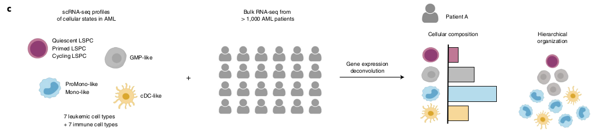

### Les LSCs fonctionnels s'associent avec l'abondance des LSPCs quiescents.

Ils ont tout d'abord voulu déterminer si un des nouveau type de LSPC est associé avec l'activité LSC[^5]. Ils ont donc performé 111 RNAseq de LAM dont l'activité LSC avait été mesuré par xenogreffe et ont appliqué la méthode de déconvolution.

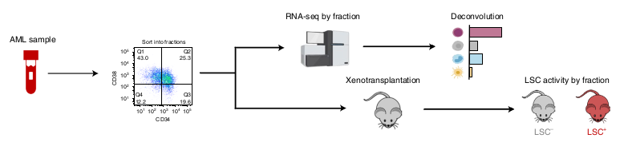

Les RNAseq ayant une LSC élevée (avec greffe réussie) sont enrichis en Quiescent LSPCs et Primed LSPCs et inversement, ceux avec une LSC faible sont enrichis en Mono-like blasts.

[^5]: définie comme l'activité permettant fonctionnellement d'initier une leucémie in vivo.

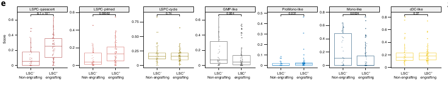

A partir de ces résultats, ils ont voulu prédire l'activité LSC à partir de cette déconvolution et elle semble être plus performante que l'immuno-phénotypage.

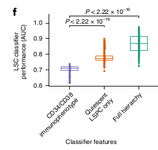

Les Quiescent LSPCs sont associés avec la fréquence de LSC+.

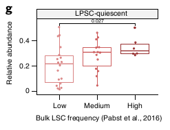

Ces résultats établissent un lien entre le transcriptomes des LSPCs et la fonction de LSCs et suggère que cette activité de LSC peut être inféré par déconvolution des données de patients.

### La composition hiérarchique est associée à la génomique des LAM

Ils ont ensuite clusterisé les données RNAseq de patients provenant de TCGA, BEATaml et Leucegene en fonction de la composition en type cellulaire prédit avec la méthode de déconvolution. Ce clustering a formé 4 sous-types distincts :
* Primitive (enrichi en LSPCs)
* Mature (enrichi en mature Mono-like et cDC-like)
* GMP (enrichi en GMP-like)
* Intermédiaire (distribution à l'équilibre)

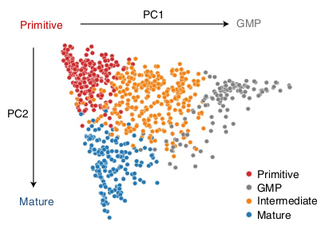  
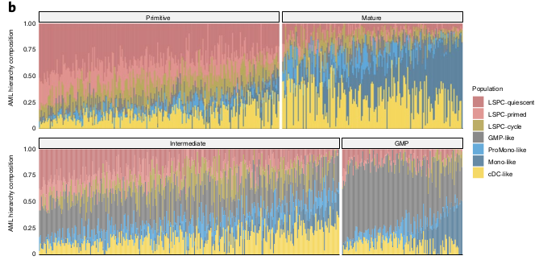  
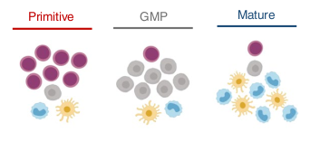

La composition était corrélée à différents paramètres cliniques comme l'âge, le WBC et la classe FAB. Ils se sont focus sur les évènements cytogénétiques et mutations.

En regardant le PC1, ils ont pu séparer différents types d'évènements cytogénétiques :

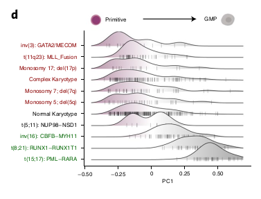

Et des évènements de mutations à partir du PC2.

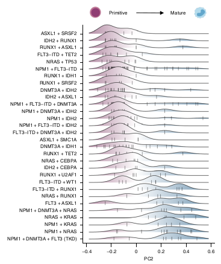

### L'analyse de l'axe Primitif versus GMP capture le prognosis du patient

La composition prédite est lié à la survie

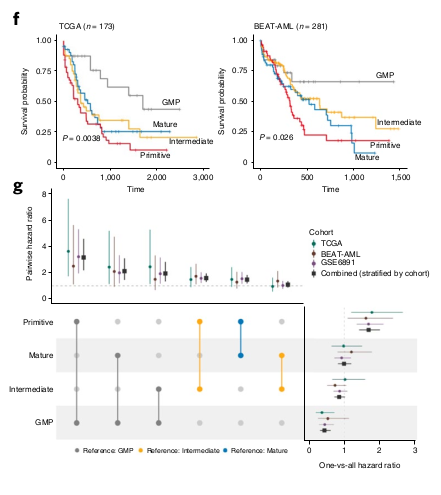

L'abondance en Quiescent LPSC et Cycling LSPC sont des signes de mauvais prognostique alors que l'abondance en GMP-like est favorable.
"Strikingly, the composite survival score that included all three of these populations was highly anti-correlated with PC1"
La PC2 ne semble pas corrélée. Cela peut être dû au PC1 qui capture une partie du score prognostique.  

### La composition hiérarchique change du diagnostique à la rechute

Pour répondre à cette question, ils ont analysé des données à la rechute et comparé avec les données au diag.

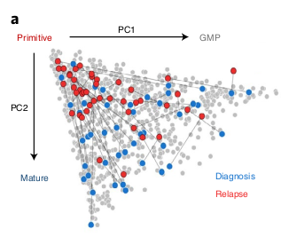

Les données à la rechute semblent plus proches du statut primitif.

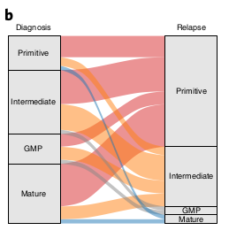

Avec un enrichissement particulier dans les Quiescent LSPCs.

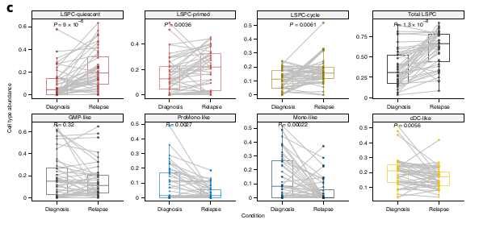

Vérification sur des données single Cells

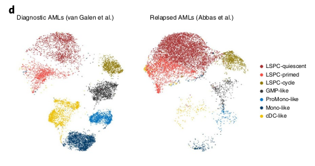

Analyse de 12.441 signatures et comparaisons avec les types cellulaires

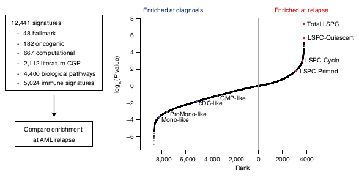

Une certaine contextualisation des pattern d'évolution clonale est possible.

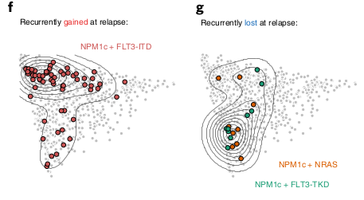

Les NPM1 mutant sont acquiert régulièrement la mutation FLT3-ITD générant des blastes plus primitifs.
Les pertes de mutations NRAS et FLT3-TKD semblent générer des matures cells.

Des shifts dans la composition hiérarchique suivent des pattern d'évolution clonale.

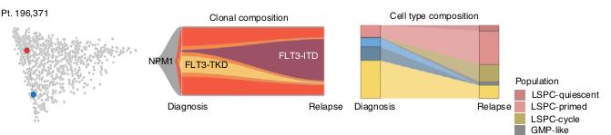

D'autres semblent liés à des modes d'évolution non-génétiques.

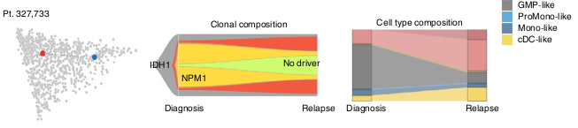

### L'axe Primitive versus Mature capture la sensitivité aux traitements ex vivo.
