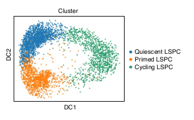
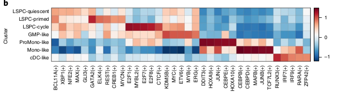

# A cellular hierarchy framework for understanding heterogeneity and predicting drug response in acute myeloid leukemia

## Résumé

Le but est de comprendre comment l'hétérogénéité est liée à la réponse à la thérapie. Pour cela, ils ont déterminé la hiérarchie des cellules leucémique à partir de transcriptomes (bulk) de 1000 patients par le biais de déconvolution en utilisant des profiles références de cellules de type souches leucémiques, progénitrices et matures décrites par des analyses de single-cells. La composition hiérarchique de la leucémie est associée à des propriétés fonctionnelles, génomiques et cliniques et convergent dans 4 classes représentant Primitive, Mature, GMP [^1] et Intermédiaire. Les variations dans la composition hiérarchique entre les axes Primitives et GMP ou Primitives et Matures sont associées à la réponse à la chimiothérapie ou à la réponse au traitements ciblés respectivement. 7 gènes biomarqueurs ont été identifiés dérivant de la comparaison Primitive vs Mature et sont associés à la réponse pour 105 médicaments expérimentaux. La composition hiérarchique cellulaire se révèle être une nouvelle approche pour mieux comprendre la biologie de la maladie et faire progresser la médecine de précision dans la LAM.

[^1]: granulocyte/monocyte progenitor

## Introduction

La LAM est caractérisée par une hétérogénéité inter et intra patient. Celle-ci rend les nouvelles thérapies aussi hétérogènes et il n'existe pas de moyens fiables pour sélectionner la meilleure thérapie pour chaque patient.  
Deux approches sont actuellement utilisées pour caractériser l'hétérogénéité de la LAM. Le modèle génomique avec les modifications cytogénétiques et les mutations. Cependant, les mêmes modifications génétiques peuvent montrer des différences fonctionnelles et même en ciblant ces mutations avec des inhibiteurs spécifiques, ces modèles ont une valeur prédictive très faible sur des thérapies ciblant certains processus biologiques ou voies de signalisation spécifiques.  
La deuxième approches est liées au caractère souche des cellules leucémiques (LSC). Ces LSC sont impliqués dans la rechute et l'expression de leurs gènes est devenue un marqueur prédisant le dévenir des patients après la chimiothérapie.  
Malheureusement, ces modèles ne sont pas suffisant et une méthode intégrant ces modèles est nécessaire.  

La composition hiérarchique cellulaire de chaque patient semblerait refléter les conséquences fonctionnelles de mutations spécifiques dans le maintien de la leucémie. Cependant, la relation entre cette composition hiérarchique et la réponse aux thérapies reste inconnue.  

Dans cette étude, les compositions hiérarchiques de plus de 1000 patients ont été caractérisées via la déconvolution de leur transcriptomes en utilisant des profiles de cellules souches, progénitrices et matures provenant de single-cell.

## Résultats

### L'hétérogénéité des cellules souches leucémique et progénitrices.

Ils ont analysé les profiles single-cell de 13.653 cellules à partir de données de 12 patients LAM au diagnostic avec un focus sur les population de cellules souches primitives et de cellules progénitrices de blastes (Maintenant appelés LSPCs[^2]).

[^2]: Leukemia stem and progenitor cells (LSPCs)

Via des analyses single-cell, ils ont identifié 3 populations dans les LSPCs :
* La population Quiescent LSPC (Faible variation d'expression)
* La population Primed LSPCs (Amorçage du cycle cellulaire)
* La population Cycling LSPCs (Cell en "cycle")

Ajout des 3 populations de LSPCs au autres types cellulaires identifiés par van Galen et al [^3] (GMP[^1]-like blasts, ProMono-like blasts, Mono-like blastes et cDC-like blasts[^4])

[^3]: ref21
[^4]: Classical Dendritic Cells

### Déconvolution des populations cellulaires constitutives de la LAM

Ils ont ensuite voulu chercher à comprendre comment ces populations de cellules LAM définies et les hiérarchies dans lesquelles elles sont organisées sont liées aux propriétés fonctionnelles, biologiques et cliniques de la LAM. Pour cela, ils ont analysé des données de transcriptomes qu'ils ont déconvolu pour inférer leur composition hiérarchique leucémique.
