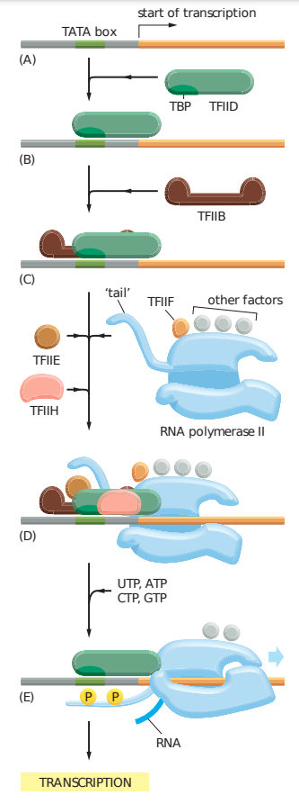

# Régulation de l’expression génique par le facteur de transcription SPI1/PU.1 dans l’érythroleucémie : mécanismes de répression des gènes par sa liaison à l’ADN, conséquences de sa liaison à l’ARN

## ***Lelia Polit***

## Table des matières

1. Introduction  
  1. La régulation de l’expression génique
    1. La transcription et ses acteurs
    2. La chromatine : organisation fonctionnelle du génome
    3. La chromatine : régulation de l’activité transcriptionnelle
  2. Le facteur de transcription SPI1, un acteur majeur de l’hématopoïèse
    1. L’hématopoïèse
    2. La famille ETS
    3. SPI1/PU.1 : structure, expression, régulation dans l’hématopoïèse
    4. SPI1 : oncogène et oncosuppresseur dans les lignées hématopoïétiques
    5. SPI1 et érythroleucémie
    6. SPI1 : un régulateur transcriptionnel
  3. Le séquençage nouvelle génération au service de la génomique
    1. Quelques notions d’histoire
    2. Le séquençage à haut débit
    3. L’analyse du séquençage à haut débit
    4. Cartographie des sites des interactions ADN-protéines : ChIP-seq
    5. Cartographie des sites des interactions ARN-protéines : CLIP-seq
    6. Cartographie des sites d’accessibilité de la chromatine : ATAC-seq
  4. Objectifs de la thèse

## Introduction

### La régulation de l’expression génique

#### La transcription et ses acteurs

Basique : Neurones, erythrocyte et hépatocyte -> même ADN pourtant diff.  
--> programme d'exp génétique diff : Synthèse d'ARN --> Assemblage de prots

#### Les éléments régulateurs de la transcription

Initiation de la transcription = association de prot régulatrices : Tfs

Facteurs généraux TFIIA, TFIIB, TFIID, TFIIE, TFIIH = pré-initiation sur le promoteur.  
Promoteur basal = TSS + régions immédiatement en amont et en aval.  
Promoteur proximal = régions en amont plus éloignées du TSS. (juste avant le début d'un gène)??

Promoteur basal = TATA-box reconnu par TFIID + recrutement RNAPolII.  
Promoteur proximal = CAAT-box et ilots CG

Initiation de la transcription assurée par TFs -> Reconnaissance de séquences spécifiques  
Sur région cis-régulatrice distale (enhancer) ou promoteur.

Enhancer = Région pouvant moduler l'exp de gène positionnée en 5' ou 3' du TSS jusqu'à 1.7M bases du TSS.

Boucle enhancer - promoter <- Cohésine et CTCF
